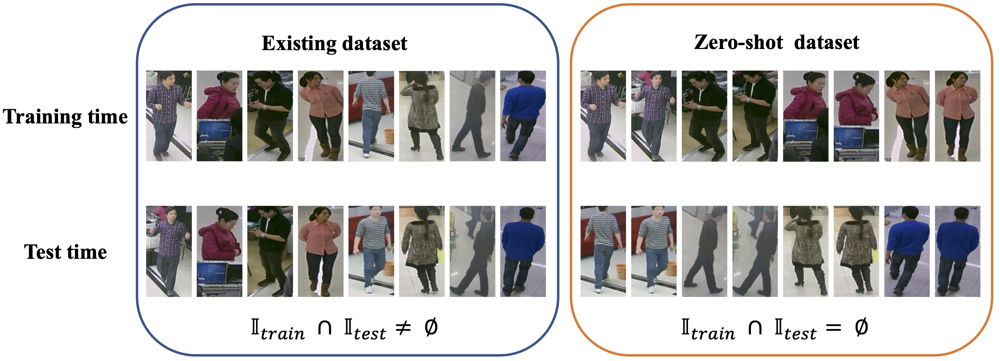

## Rethinking of Pedestrian Attribute Recognition: A Reliable Evaluation under Zero-Shot Pedestrian Identity Setting (official Pytorch implementation)


_This [paper](https://arxiv.org/abs/2107.03576) submitted to TIP is the extension of the previous [Arxiv paper](https://arxiv.org/abs/2005.11909)._


#### This project aims to 
1. provide a strong baseline for __Pedestrian Attribute Recognition__ and __Multi-Label Classification__.
2. provide two new datasets RAPzs and PETAzs following zero-shot pedestrian identity setting.
3. provide a general training pipeline for pedestrian attribute recognition and multi-label classification task.

#### This project provide
1. DDP training, which is mainly used for multi-label classifition.
2. Training on all attributes, testing on "selected" attribute. Because the proportion of positive samples for other attributes is less than a threshold, such as 0.01.
   1. For PETA and PETAzs, 35 of the 105 attributes are selected for performance evaluation.
   2. For RAPv1, 51 of the 92 attributes are selected for performance evaluation. 
   3. For RAPv2 and RAPzs, 54 and 53 of the 152 attributes are selected for performance evaluation.
   4. For PA100k, all attributes are selected for performance evaluation.
   - However, training on all attributes _can not bring_ consistent performance improvement on various datasets.
3. EMA model. 
4. Transformer-base model, such as swin-transformer (with a huge performance improvement) and vit.
5. Convenient dataset info file like dataset_all.pkl


## Dataset Info
- PETA: Pedestrian Attribute Recognition At Far Distance [[Paper](http://mmlab.ie.cuhk.edu.hk/projects/PETA_files/Pedestrian%20Attribute%20Recognition%20At%20Far%20Distance.pdf)][[Project](http://mmlab.ie.cuhk.edu.hk/projects/PETA.html)]

- PA100K[[Paper](http://openaccess.thecvf.com/content_ICCV_2017/papers/Liu_HydraPlus-Net_Attentive_Deep_ICCV_2017_paper.pdf)][[Github](https://github.com/xh-liu/HydraPlus-Net)]

- RAP : A Richly Annotated Dataset for Pedestrian Attribute Recognition 
  - v1 [[Paper](https://arxiv.org/pdf/1603.07054v3.pdf)][[Project](http://www.rapdataset.com/)]
  - v2 [[Paper](https://ieeexplore.ieee.org/abstract/document/8510891)][[Project](http://www.rapdataset.com/)]

- PETAzs & RAPzs : Rethinking of Pedestrian Attribute Recognition: A Reliable Evaluation under Zero-Shot Pedestrian Identity Setting [Paper](https://arxiv.org/abs/2107.03576) [[Project](http://www.rapdataset.com/)]


## Performance 

### Pedestrian Attribute Recognition

|Datasets|Models|ma|Acc|Prec|Rec|F1|
|:------:|:---:|---|---|---|---|---|
|PA100k|resnet50|80.21|79.15|87.79|87.01|87.40|
|--|resnet50*|79.85|79.13|89.45|85.40|87.38|
|--|resnet50 + EMA|81.97|80.20|88.06|88.17|88.11|
|--|bninception|79.13|78.19|87.42|86.21|86.81|
|--|TresnetM|74.46|68.72|79.82|80.71|80.26|
|--|swin_s|82.19|80.35|87.85|88.51|88.18|
|--|vit_s|79.40|77.61|86.41|86.22|86.32|
|--|vit_b|81.01|79.38|87.60|87.49|87.55|
|PETA|resnet50|83.96|78.65|87.08|85.62|86.35|
|PETAzs|resnet50|71.43|58.69|74.41|69.82|72.04|
|RAPv1|resnet50|79.27|67.98|80.19|79.71|79.95|
|RAPv2|resnet50|78.52|66.09|77.20|80.23|78.68|
|RAPzs|resnet50|71.76|64.83|78.75|76.60|77.66|

 - The resnet* model is trained by using the weighted function proposed by Tan in [AAAI2020](https://ojs.aaai.org/index.php/AAAI/article/view/6883).
 - Performance in PETAzs and RAPzs based on the first version of PETAzs and RAPzs as described in [paper](https://arxiv.org/abs/2107.03576).
 - Experiments are conducted on the input size of (256, 192), so there may be minor differences from the results in the paper.
 - The reported performance can be achieved at the first drop of learning rate. We also take this model as the best model.
 - Pretrained models are provided now at [Google Drive]().

### Multi-label Classification

|Datasets|Models|mAP|CP|CR|CF1|OP|OR|OF1|
|--------|---|---|---|---|---|---|---|---|
|COCO|resnet101|82.75|84.17|72.07|77.65|85.16|75.47|80.02|


## Pretrained Models


## Dependencies

- python 3.7
- pytorch 1.7.0
- torchvision  0.8.2
- cuda 10.1


## Get Started
1. Run `git clone https://github.com/valencebond/Rethinking_of_PAR.git`
2. Create a directory to dowload above datasets. 
    ```
    cd Rethinking_of_PAR
    mkdir data
    ```
3. Prepare datasets to have following structure:
    ```
    ${project_dir}/data
        PETA
            images/
            PETA.mat
            dataset_all.pkl
            dataset_zs_run0.pkl
        PA100k
            data/
            dataset_all.pkl
        RAP
            RAP_dataset/
            RAP_annotation/
            dataset_all.pkl
        RAP2
            RAP_dataset/
            RAP_annotation/
            dataset_zs_run0.pkl
        COCO14
            train2014/
            val2014/
            ml_anno/
                category.json
                coco14_train_anno.pkl
                coco14_val_anno.pkl
    ```
4. Train baseline based on resnet50
    ```
    sh train.sh
    ``` 
 
## Acknowledgements

Codes are based on the repository from [Dangwei Li](https://github.com/dangweili/pedestrian-attribute-recognition-pytorch) 
and [Houjing Huang](https://github.com/dangweili/pedestrian-attribute-recognition-pytorch). Thanks for their released code.


### Citation

If you use this method or this code in your research, please cite as:

    @article{jia2021rethinking,
      title={Rethinking of Pedestrian Attribute Recognition: A Reliable Evaluation under Zero-Shot Pedestrian Identity Setting},
      author={Jia, Jian and Huang, Houjing and Chen, Xiaotang and Huang, Kaiqi},
      journal={arXiv preprint arXiv:2107.03576},
      year={2021}
    }


